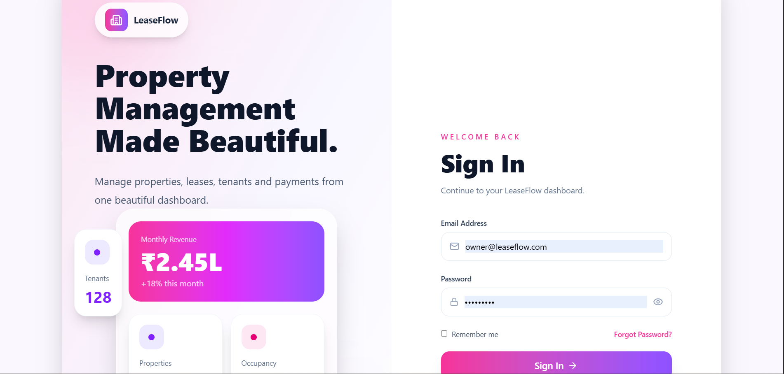
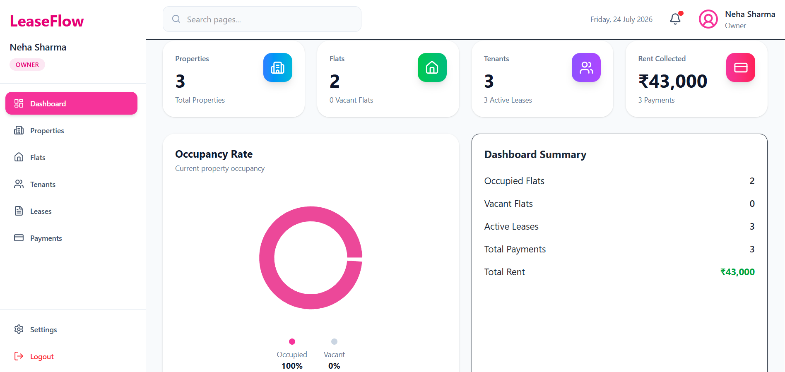
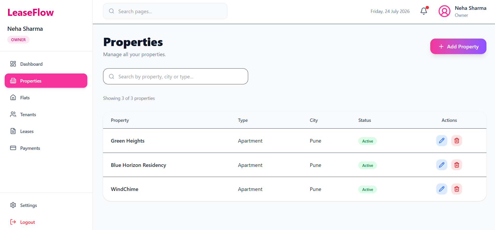

# 🏠 LeaseFlow

A modern full-stack Property Management System built with **FastAPI, React, TypeScript, PostgreSQL, and JWT Authentication**.

## 📌 Overview

LeaseFlow is a full-stack web application designed to simplify property management. It enables property owners to manage properties, flats, tenants, leases, and rent payments through a secure and user-friendly interface.

## ✨ Features

- 🔐 JWT Authentication
- 🏢 Property Management
- 🏠 Flat Management
- 👥 Tenant Management
- 📄 Lease Management
- 💳 Rent Payment Tracking
- 📊 Dashboard with Analytics
- 🔍 Search & Filter
- 📱 Responsive UI

## 🛠️ Tech Stack

### Frontend
- React
- TypeScript
- Vite
- Tailwind CSS

### Backend
- FastAPI
- SQLAlchemy
- PostgreSQL
- Alembic
- JWT Authentication

## 🚀 Installation

### Clone the repository

```bash
git clone https://github.com/MinalPatil18/LeaseFlow.git
cd LeaseFlow
```

### Backend

```bash
python -m venv .venv
.venv\Scripts\activate
pip install -r requirements.txt
uvicorn app.main:app --reload
```

### Frontend

```bash
cd frontend
npm install
npm run dev
```

## 📸 Screenshots

### Login



### Dashboard



### Properties




## 👩‍💻 Author

**Minal Patil**

GitHub: https://github.com/MinalPatil18
